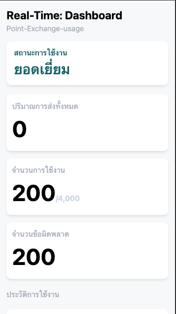

### Real-time Point-Exchange-application



## Introduction

This application is designed to monitor and manage connections using Zero Trust login and ZeroTier. It also monitors line usage and integrates with Kafka for real-time data processing.

## Features

- **Zero Trust Login**: Ensures secure access to the application.
- **ZeroTier Monitoring**: Monitors and manages ZeroTier network connections.
- **Line Usage Monitoring**: Tracks and reports on network line usage.
- **Kafka Integration**: Utilizes Kafka for real-time data streaming and processing.

## Installation

To install and set up the application, follow these steps:

1. Clone the repository:
    ```sh
    git clone https://github.com/your-repo/point-exchange-app.git
    cd point-exchange-app
    ```

2. Install dependencies:
    ```sh
    npm install
    ```

3. Configure environment variables:
    - Create a `.env` file in the root directory.
    - Add necessary configuration values (e.g., Kafka brokers, ZeroTier API keys).

4. Start the application:
    ```sh
    npm start
    ```

## Usage

1. **Zero Trust Login**:
    - Access the login page.
    - Enter your credentials to securely log in.

2. **ZeroTier Monitoring**:
    - Navigate to the ZeroTier monitoring section.
    - View and manage your ZeroTier network connections.

3. **Line Usage Monitoring**:
    - Go to the line usage section.
    - Monitor real-time usage statistics and reports.

4. **Kafka Integration**:
    - Ensure Kafka is running and properly configured.
    - The application will automatically stream and process data using Kafka.

## Technologies Used

- **Zero Trust Login**: Secure authentication mechanism.
- **ZeroTier**: Network virtualization technology.
- **Kafka**: Distributed streaming platform.
- **Node.js**: JavaScript runtime for server-side development.
- **Express**: Web framework for Node.js.
- **React**: Front-end library for building user interfaces.

For more detailed information, please refer to the [documentation](docs/documentation.md).